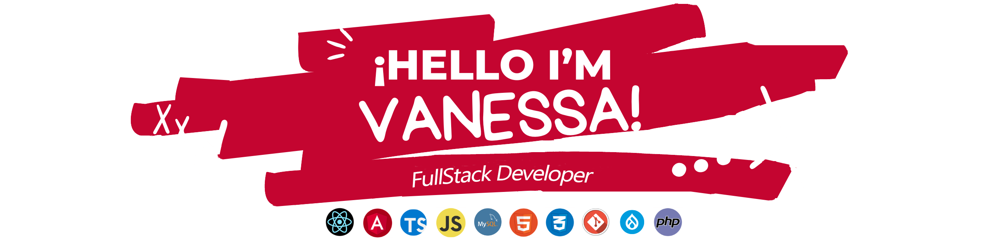

  

  

  
<h2>About me</h2>

 ✨ I'm a starter Angular/React Developer and a Mid experienced with Drupal✨ , in love with languages with components and CMS.  I'm from Málaga - Andalucía - Spain and I'm 35 years old 😄. ❤.  I am a decisive, creative and independent person 😁.   If you want to know more about me, contact me 🤗. 

<h2>My projects</h2>
Look my projects and askme if you need more info! </a>  

👇👇👇👇👇👇

<!--
**vanemp21/vanemp21** is a ✨ _special_ ✨ repository because its `README.md` (this file) appears on your GitHub profile.

Here are some ideas to get you started:

- 🔭 I’m currently working on ...
- 🌱 I’m currently learning ...
- 👯 I’m looking to collaborate on ...
- 🤔 I’m looking for help with ...
- 💬 Ask me about ...
- 📫 How to reach me: ...
- 😄 Pronouns: ...
- ⚡ Fun fact: ...
-->
